# Firewall
## Purpose

The firewall layer is a critical security boundary within the homelab network. It enforces where, how, and from whom traffic can flow — ensuring that all ingress originates through the VPS Gateway and WireGuard VPN, and that no service is ever exposed directly over the public internet.

## Firewalls work hand-in-hand with the VPN and VPS to:
* Force all public ingress through the secure WireGuard tunnel
* Prevent external systems from reaching private infrastructure directly
* Control inter-node (east-west) communication within the cluster
* Maintain a clear separation between public, private, and management networks

## Design Overview
### Diagram: 

```mermaid
%%{init: {'themeVariables': { 'fontSize': '14px', 'fontFamily': 'monospace' }}}%%
flowchart TD
  A["🌐 Internet<br/>Public traffic<br/><br/>"]
  B["🧭 VPS Gateway<br/>Firewall (Cloud Level)<br/>WireGuard Entry Point<br/><br/>"]
  C["🔒 WireGuard Tunnel<br/>Encrypted Channel<br/><br/>"]
  D["🏠 Home Firewall<br/>Edge Enforcement<br/>UFW / nftables<br/><br/>"]
  E["🧩 K3s Cluster<br/>Internal NetworkPolicies<br/><br/>"]

  A -->|"Public HTTPS / WireGuard"| B
  B -->|"Allowed peers only"| C
  C -->|"VPN-encrypted traffic"| D
  D -->|"Validated routes only"| E
```

### All network paths follow a “VPN-first” policy:
no traffic enters the homelab from the public internet without first traversing the WireGuard-encrypted channel that connects the VPS and home servers.

### Key Enforcement Layers
1. #### VPS Gateway Firewall (Cloud Level)
* Accepts public HTTPS and VPN (WireGuard) connections only
* Drops any attempt to reach internal IPs or ports directly
* Forwards authenticated WireGuard traffic into the private tunnel
* Routes requests to internal services only when explicitly defined
2. #### Home Server Firewall (Edge Level)
* Accepts inbound connections only from the VPS’s WireGuard IP
* Rejects or drops all other public inbound requests
* Ensures public-facing services (e.g., wiki, API, dashboards) are accessible only via the VPN path
3. #### Cluster-Level Policies (Internal Level)
* Kubernetes NetworkPolicies define pod-to-pod (east-west) traffic rules
* UFW and nftables reinforce these controls on the host OS
* Namespaces are isolated so a breach in one workload cannot laterally move through the cluster
### Interaction with VPN and VPS
#### The VPN and firewall layers operate together as a single access funnel:
* The VPS Gateway exposes only the WireGuard port and public service endpoints.
* The WireGuard Tunnel carries encrypted packets into the homelab network.
* The Home Firewall validates that the source is the VPS peer and only then permits forwarding to internal hosts.
* If a route is not explicitly configured or a peer not allowed, packets simply die at the VPS — never reaching the internal network.
#### This architecture ensures:
* No direct exposure of the residential IP or LAN devices
* Complete ingress control via VPN routing policies
* Granular path definition (traffic must match an allowed route)

#### Tools and Configuration
* The firewall layer relies on several tools across different layers:
* UFW for simple interface-level rules (default deny, allow from VPS subnet only)
* nftables for fine-grained packet filtering and NAT handling
* Kubernetes NetworkPolicies for namespace-level isolation
* Fail2Ban and rate limiting for brute-force and flood protection on public services

## Example:

### Allow traffic only from VPS WireGuard IP
```bash
ufw allow from 10.100.0.1 to any port 443 proto tcp
ufw deny in from any to any
```
## Security Practices
* Public ingress is only through the VPS → WireGuard → Homelab path
* SSH and admin ports restricted to specific WireGuard peers
* Default-deny policy at every layer (cloud, OS, and cluster)
* Planned automation of firewall and routing rules through Ansible for consistent policy management

## Summary

The firewall layer enforces the principle that if it’s not through the VPN, it doesn’t exist.
It acts as both a shield and a gatekeeper — ensuring all inbound traffic comes through approved, encrypted channels and that even internal communications remain strictly controlled.

Together, the VPS Gateway, WireGuard VPN, and firewall stack create a defense-in-depth perimeter that isolates, encrypts, and audits every connection to the homelab.

### Breadcrumb:
[Infrastructure](/public/infrastructure) › [Networking](/public/infrastructure/networking) › [Firewall](/public/infrastructure/networking/firewall)